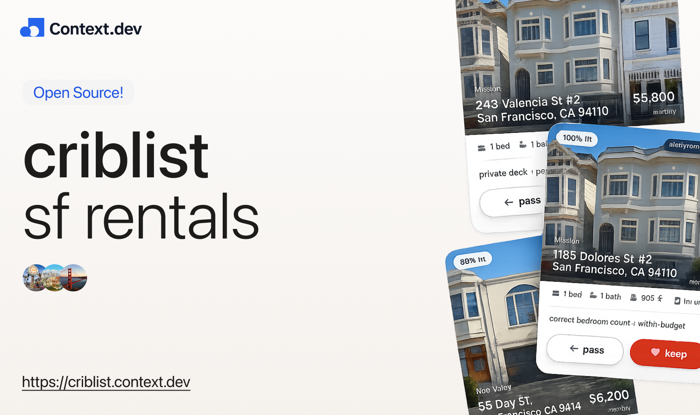

<p align="center">
  
</p>

<p align="center"><em>the sf hunt, minus the hunting.</em></p>

<p align="center">
  
</p>

## Built on Context.dev

Criblist is a live showcase of the
[Context.dev Web Extraction API](https://context.dev). Context turns rental
sites into fast, usable documents; Criblist turns those documents into a
ranked apartment deck.

Context.dev powers the marketplace-discovery side of the search pipeline:

1. The **HTML API** renders live Craigslist search results through automatic
   proxy escalation, preserving the exact listing links.
2. The **Extract API** turns four property-manager inventory pages into
   schema-validated listing candidates.
3. The **Brand API** enriches the landing page with the identity of every
   provider in the live search network.
4. Criblist verifies detail pages and combines them with four direct inventory
   sources.
5. The shared pipeline normalizes, deduplicates, filters, and ranks all nine
   providers into one consistent deck.

The Context.dev API key stays server-side. Source adapters run concurrently,
short-lived caches make repeat searches fast, and the first direct feeds open
the deck without waiting for the deeper Context extraction lane.

## The product

Criblist asks for the few apartment constraints that matter, searches listings
that are live right now, and gives the renter one home at a time to swipe,
inspect, or shortlist.

- Live Craigslist and independent SF property-manager inventory
- Budget, bedroom, bathroom, neighborhood, laundry, pet, dishwasher, and size
  filters
- Photo-backed cards with match reasons and honest caveats
- Provider diversity so one marketplace cannot dominate the deck
- Preloaded photography for fast galleries and card transitions
- Browser-local preferences, deck progress, and shortlist

## Local setup

Requirements:

- Node.js 20 or newer
- A [Context.dev API key](https://context.dev)

```bash
cp .env.example .env.local
# Add the Context.dev and Turso credentials to .env.local

npm install
npm run dev
```

Open [http://localhost:3000](http://localhost:3000).

## Commands

```bash
npm run dev
npm run lint
npm run typecheck
npm test
npm run stress:search
npm run cache:warm
npm run cache:watch -- --interval-minutes=30
npm run build
npm run start
```

## Architecture

```text
app/
├── _components/criblist/      product UI and client state
├── _components/ui/            small reusable visual primitives
├── _lib/                      shared browser utilities
├── api/apartment-search/      thin search HTTP route
└── api/cron/refresh-listings/ protected inventory refresh route

server/search/
├── apartment-deck.ts          filtering, scoring, diversity, and diagnostics
├── context-client.ts          Context.dev transport
├── extracted-inventory.ts     shared Context Extract inventory adapter
├── listing-card.ts            listing normalization and preference matching
├── schemas.ts                 upstream source contracts
├── sources.ts                 source acquisition network
└── service.ts                 search and refresh orchestration

server/cache/
├── listings.ts                Turso-backed listing inventory
└── refresh.ts                 full source and bedroom refresh orchestration

shared/
├── providers.ts               source, lane, and provider catalog
└── search-contract.ts         shared browser/server search contract
```

The browser sends one validated preference object to three parallel lanes at
`POST /api/apartment-search`: fast direct feeds, Context-powered Craigslist,
and Context Extract. The first successful lane opens the deck; later matches
join it without resetting progress. Every adapter normalizes into one card
contract and passes through the same strict quality gates. Fresh Turso
inventory is served first; live adapters refill missing or expired segments.

## Live sources

- Craigslist San Francisco
- Brick + Timber
- RentSFNow
- Mosser Living
- J. Wavro Associates
- Rentals Inc.
- Rentals in SF
- Landmark Real Estate
- ReLISTO

Each adapter starts from the provider's current-availability page instead of a
stale search index.

## Environment

| Variable | Required | Purpose |
| --- | --- | --- |
| `CONTEXT_DEV_API_KEY` | yes | Context.dev HTML, Extract, and Brand API access |
| `TURSO_DATABASE_URL` | recommended | Persistent listing inventory |
| `TURSO_AUTH_TOKEN` | recommended | Authenticates listing cache reads and writes |
| `CRON_SECRET` | production | Protects the scheduled inventory refresh route |
| `NEXT_PUBLIC_SITE_URL` | no | Canonical URL for social metadata |

Do not commit `.env.local`.

Vercel calls the protected inventory route every 30 minutes in production.
For local development, run `npm run cache:warm` once or use
`npm run cache:watch -- --interval-minutes=30`. Cache coverage expires after
45 minutes. Listings are never served after 12 hours without being seen again
and are pruned during the next refresh.

## Product principles

- Fewer choices, shown well.
- No dead listings to make the deck look larger.
- No listing without a usable photo.
- Source diversity without weakening user filters.
- Fast searches through a continuously refreshed Turso inventory.

## License

MIT
